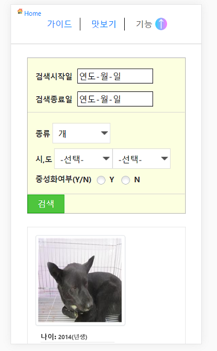
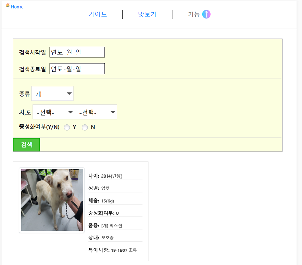
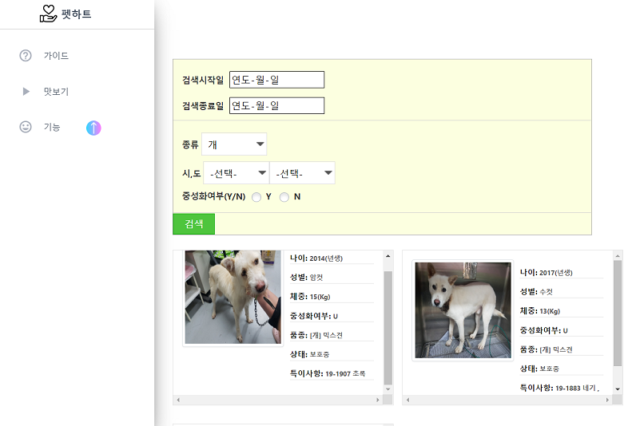

# PetServiceComputing_Web


### 개요 

공공데이터포탈 동물보호관리시스템 Open API를 이용해 전국의 유기동물, 보호시설 대행업체정보를
웹사이트에서 원하는 조건에따라 검색 및 확인하는 서비스제공

If you wanna view website, click [Here](http://nebiros.pythonanywhere.com/)

<br>

개발기간
-------------
* 2019.10 ~ ing

<br>

개발환경
-------------
* Visual studio code 
* Python 3.7.4 

<br>

개발기술, 언어
-------------
* Flask framework
* HTML5, CSS
* Vanila Javascript
* jQuery, ajax
* REST API

<br>

사용 API
-------------
* 동물보호관리시스템 유기동물 조회 서비스
* 반려동물 등록대행업체 조회 서비스
* Kakao Maps API
* Geocoding Service

<br>

실행절차
--------

1. git clone 혹은 파일을 다운받는다

2. visual studio code에서 설치한 폴더를 연다.

3. terminal창에서 아래의 명령어를 입력한다.

<br>

To run app.py, install several files
```ruby
pip install request, requests, xmltodict
```

then run app.py
```shell
python app.py
```

<br>

실행화면
-----------------------
<br>

Mobile 환경
</img>

<br>

Tablet 환경
</img>

<br>

PC 환경
</img>

<br>

참고자료
----------------

* [bluebibi/flask_rest](https://github.com/bluebibi/flask_rest)
* [웹서비스 기술 익히기 - flask 기본 사용법](https://www.fun-coding.org/flask_basic-2.html)
* [stackoverflow](https://stackoverflow.com/)
* [동물보호관리시스템 유기동물 조회 서비스](https://www.data.go.kr/dataset/15001096/openapi.do)
* [반려동물 등록대행업체 조회 서비스](https://www.data.go.kr/dataset/15001097/openapi.do)
* [Kakao Maps API](http://apis.map.kakao.com/web/documentation/)
* [Geocoding Service](https://developers.google.com/maps/documentation/javascript/geocoding)

<br>

Author
------------

* [JmKanmo](https://github.com/JmKanmo)

<br>

License
------------

* This project is licensed under the MIT License - see the LICENSE.md file for details
